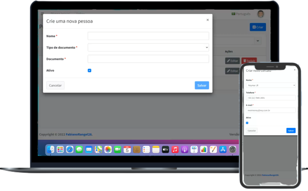
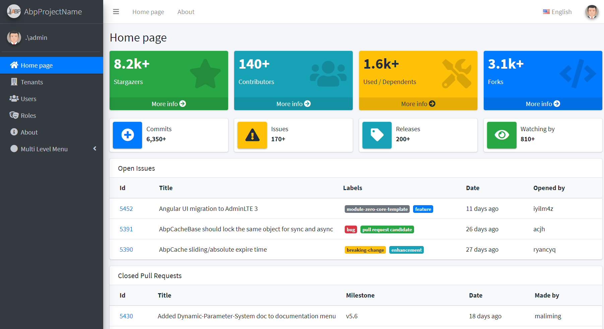
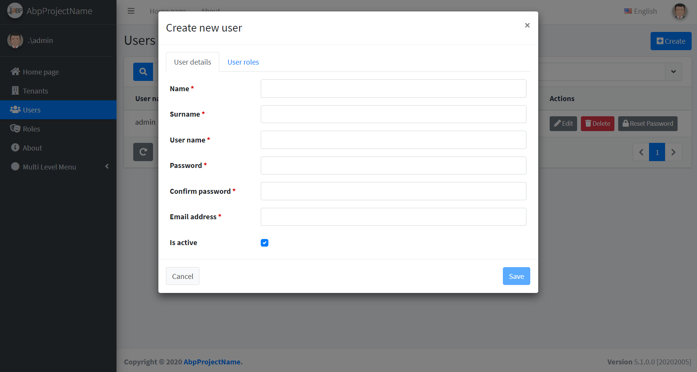
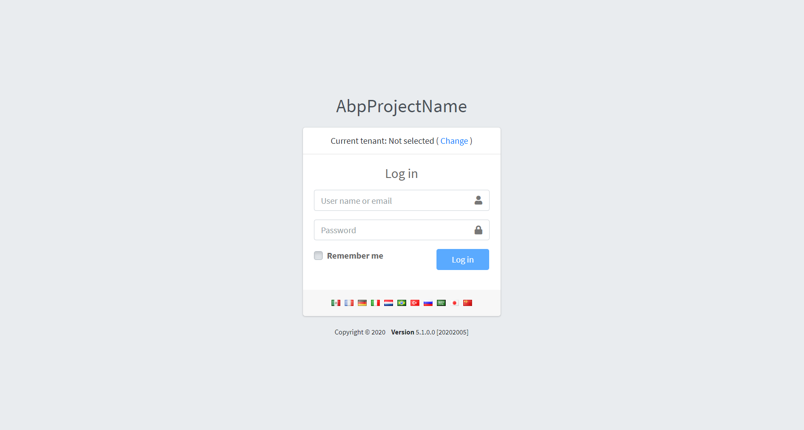

<h1 align="center">
    
</h1>

  <a href="#-tecnologias">Tecnologias</a>&nbsp;&nbsp;&nbsp;|&nbsp;&nbsp;&nbsp;
  <a href="#-projeto">Projeto</a>&nbsp;&nbsp;&nbsp;|&nbsp;&nbsp;&nbsp;
  <a href="#-layout">Layout</a>&nbsp;&nbsp;&nbsp;|&nbsp;&nbsp;&nbsp;
  <a href="#memo-licença">Licença</a>

 

  

 

  

## 🚀 Tecnologias

Esse projeto foi desenvolvido com as seguintes tecnologias:

- [.Net Framework 4.6.1](https://visualstudio.microsoft.com/pt-br/thank-you-downloading-visual-studio/)
- [C#](https://docs.microsoft.com/pt-br/dotnet/csharp/)
- [Angular](https://angular.io/)
- [ABP](https://aspnetboilerplate.com/Pages/Documents/v5.14/)
- [TypeScript](https://www.typescriptlang.org/)

## 💻 Projeto

O desafio é uma aplicação que cadastra pessoas e contatos dessas pessoas.

## Criação do banco de dados

Faça o download do projeto.  
Abra a solução contida na pasta "aspnet-full" no Visual Studio.  
Altere a string de conexão do banco de dados no arquivo appsettings.json, que se encontra dentro do projeto "UniSolution.FabianoRangel26.Web.Host".  
Para gerar o banco de dados do projeto, acesse o Package Manager Console e execute os seguintes comandos:  
	1. Selecione o Default project "src\UniSolution.FabianoRangel26.EntityFrameworkCore"  
	2. Digite o comando "Update-Database" (sem as aspas)  
	
Após o banco de dados ser gerado, execute o projeto.  

## Informações de login

Usuário: admin  
Senha: 123qwe

## 🔖 Layout

Nos links abaixo você encontra o layout do projeto web e também do mobile. Lembrando que você precisa ter uma conta no [Figma](http://figma.com/) para acessá-lo.

- [Layout](https://www.figma.com/file/YuRVOtzvITeZeHZEzhKuYL/UniSolution%2FFabianoRangel26?node-id=49828%3A152)

## 🧠 Desafio

No link a seguir você encontra o desafio proposto para que você possa entender e incrementar ainda mais essa aplicação.

- [Desafio UniSolution](https://ruddy-biology-d93.notion.site/Escopo-do-Desafio-0fa43182ba504cf097ca7ca13d61d6fd)

## :memo: Licença

Esse projeto está sob a licença MIT. Veja o arquivo [LICENSE](LICENSE.md) para mais detalhes.

---

Feito com ♥ by FabianoRangel26 :wave: [Participe da nossa comunidade!](https://discord.gg/swaQNf9)

# Important

Issues of this repository are tracked on https://github.com/aspnetboilerplate/aspnetboilerplate. Please create your issues on https://github.com/aspnetboilerplate/aspnetboilerplate/issues.

# Introduction

This is a template to create **ASP.NET Core MVC / Angular** based startup projects for [ASP.NET Boilerplate](https://aspnetboilerplate.com/Pages/Documents). It has 2 different versions:

1. [ASP.NET Core MVC & jQuery](https://aspnetboilerplate.com/Pages/Documents/Zero/Startup-Template-Core) (server rendered multi-page application).
2. [ASP.NET Core & Angular](https://aspnetboilerplate.com/Pages/Documents/Zero/Startup-Template-Angular) (single page application).
 
User Interface is based on [AdminLTE theme](https://github.com/ColorlibHQ/AdminLTE).
 
# Download

Create & download your project from https://aspnetboilerplate.com/Templates

# Screenshots

#### Sample Dashboard Page

#### User Creation Modal

#### Login Page

# Documentation

* [ASP.NET Core MVC & jQuery version.](https://aspnetboilerplate.com/Pages/Documents/Zero/Startup-Template-Core)
* [ASP.NET Core & Angular  version.](https://aspnetboilerplate.com/Pages/Documents/Zero/Startup-Template-Angular)

# License

[MIT](LICENSE).
